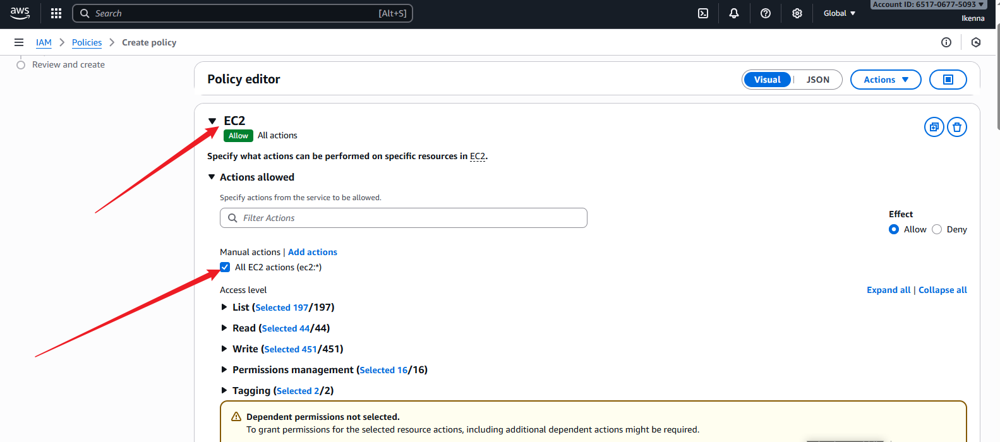
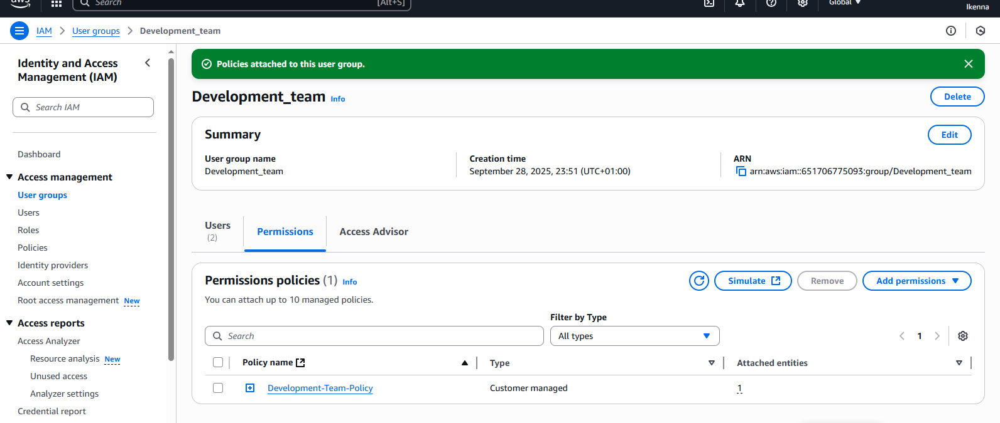

# AWS-IAM
# Introduction 
```
This project introduces AWS Identity and Access Management (IAM) by focusing on creating and managing users, groups, and policies. You will practice securing AWS resources through proper access control while gaining hands-on experience. The project emphasizes the importance of IAM in ensuring a secure, efficient, and well-managed cloud environment.
```
# Definition of Terms

## What is IAM?

`Identity and Access Management (IAM)` is a core AWS service that acts as the `security gatekeeper` for your cloud environment. It controls who can access your AWS resources and `what actions they are allowed to perform.`

Think of your AWS account as a `digital house` filled with valuable resources such as data, applications, and services. You would not want just anyone to walk in and make changes. IAM serves as your `VIP access list`, ensuring only trusted individuals are allowed in, and each person can only do the tasks you approve. In this way, IAM keeps your cloud environment organized, secure, and protected against unwanted access.

Note: AWS resources are the services and tools provided by Amazon Web Services `(such as EC2, S3, or RDS)` that you can use to build and manage applications and infrastructure in the cloud.

## W#hat is an IAM User?

An `IAM user` represents a single identity (such as a person or an application) within your AWS environment. Each user has unique credentials (username, password, and optionally access keys) that allow them to log in and interact with AWS resources.
```
For example, if you have a project team, you can create separate IAM users for each member. This ensures everyone logs in with their own account and can be given access only to the resources they need. IAM users help maintain accountability and security by making sure access is personalized and limited to job responsibilities.
```
## What is an IAM Role?

An `IAM role` defines a set of permissions that specify what an entity—whether a user, service, or application—can do within your AWS account. Unlike IAM users, roles do not have permanent credentials. Instead, they are `assumed temporarily` when specific access is needed.

For instance, you might have an `Admin role` that grants full access across `AWS, or a Developer role` that limits access to development resources only. A helpful analogy is a `temporary house key`: instead of giving someone a permanent key (IAM user), you provide a temporary one (IAM role) that works for a limited time and only opens specific rooms (AWS resources).
```
IAM roles are especially useful for granting permissions to AWS services, enabling cross-account access, or providing temporary access to external users. They strengthen security by eliminating the need for permanent credentials and ensuring permissions are granted only when required.
```
## What is an IAM Policy?

An `IAM policy` is a rulebook that defines what actions are allowed or denied within your AWS environment. Policies are attached to users, groups, or roles, and specify which AWS resources they can access and what they can do with them.

For example, a policy might allow an `Admin role` to create, delete, or modify all resources, while a `Viewer role` can only view resources without making changes. Policies provide precise, fine-grained control, ensuring only authorized actions are performed. They are essential for enforcing security, preventing mistakes, and ensuring compliance within AWS accounts.

## What is an IAM Group?

An `IAM group` is a collection of IAM users that share the same set of permissions. Instead of assigning permissions to each user individually, groups allow you to organize users by role or responsibility and manage their permissions collectively.

For example, if you have a team of developers, you can create a group called `“Developers”` and add all developer users to it. By attaching a policy to the group, all members automatically inherit the same permissions. This makes managing permissions more efficient, reduces administrative overhead, and ensures consistency across teams.

IAM groups are particularly useful in larger organizations where multiple users perform similar tasks, such as `Administrators, Developers, or Analysts.` They simplify access management and help maintain security best practices.

## IAM Best Practices
```
When working with IAM in AWS, it’s important to follow best practices to keep your cloud environment secure and well-organized. Here are some key guidelines:
```
- `Grant the least privilege:` 
```
Always give users, groups, or roles only the permissions they need to perform their tasks—no more. This reduces the risk of accidental or malicious misuse.
```
- `Use roles instead of long-term users:` 
```
IAM roles are safer than creating many IAM users. Roles provide temporary, flexible access that can be assumed by different people or applications when needed.
```
- `Regularly review roles and permissions:` 
```
Remove unused roles, users, or groups to avoid clutter and minimize security risks. Keeping your environment tidy ensures tighter access control.
```
- `Enable Multi-Factor Authentication (MFA):` 
```
Add an extra layer of security by requiring MFA for users. This helps protect accounts even if passwords are stolen.
```
- `Leverage AWS-managed policies:` 
```
Start with AWS’s prebuilt policies whenever possible. They are well-tested, secure, and easier to manage than writing custom ones from scratch.
```
- `Keep policies simple and specific:` 
```
Instead of one large, complex policy, create smaller, task-based policies. For example, separate a "Read-only S3" policy from an "Admin EC2" policy.
```
- `Track and audit changes:` 
```
Use AWS CloudTrail and other monitoring tools to keep a record of who made changes, when, and why. This helps with security audits and troubleshooting.
```
- `Test policies before production use:` 
```
Always validate that a policy behaves as expected in a safe environment before applying it to critical resources.
```
- `Use descriptive naming conventions:` Give clear names to IAM users, groups, roles, and policies. For example, `DevOps-EC2-Admin` is easier to understand and manage than `Policy123.`

- `Enforce strong password policies:` 
```
Require users to create complex passwords with expiration and rotation rules. This prevents weak credentials from being an entry point for attackers.
```
## Understanding the Difference: Users vs. Roles

- `IAM Users:` 
  ```
  IAM users represent specific individuals with permanent access keys tied directly to them. Think of it like each person having their own front-door key to the digital house. The key is theirs alone and does not expire unless you rotate it.
  ```

- `IAM Roles:` 
  ```
  IAM roles, on the other hand, provide temporary access keys that can be used by multiple people, services, or applications as needed. This is like giving out a master key that grants access only for a limited time and to specific rooms. Roles are more flexible and reduce the need to manage permanent credentials.
  ```

- `Note on MFA`
  ```
  Multi-Factor Authentication (MFA) adds an extra verification step (such as a code from a mobile device) when logging in. It ensures that even if a password is compromised, the account remains protected. AWS strongly recommends enabling MFA for all privileged IAM accounts.
  ```
## Practical Example: GatoGrowFast.com
```
Here i will apply what we’ve learned with a real-world example. Suppose a growth marketing consultancy company, GatoGrowFast.com, wants to grant AWS access to three employees: Eric, Jack, and Ade.
```
We’ll handle this in two parts:

`Part 1` — Creating a User with a Policy

- Create an IAM policy that grants full access to EC2.
- Create an IAM `user` named `Eric`.
- Attach the EC2 full-access policy to Eric, so he can manage EC2 resources directly.

`Part 2` — `Using Groups for Multiple Users`
- Create an IAM group (for example, called `Marketing-Team`).
- Add `Jack and Ade` as members of this group.
- Create a new `IAM policy` that grants full access to both EC2 and S3.
- Attach this policy to the group.

`Note:` By doing this, Jack and Ade automatically inherit the group permissions without assigning policies individually.

- Hands on project setup demonstrates best practices in action:
- Eric is managed as a single user with a targeted policy.
- Jack and Ade are managed collectively through a group, making permissions easier to update and maintain.

## Part 1

Begin by logging into the AWS Management Console using your account credentials. This is the main dashboard where you can access and manage all AWS services.

Once logged in, locate the search bar at the top of the console. In the search field, type “IAM” (Identity and Access Management). From the drop-down suggestions, click on IAM to open the IAM service dashboard.


- From the IAM dashboard, look at the navigation menu on the left-hand side and select Policies.
- In the search bar, type EC2 to filter available policies. From the results, locate and select AmazonEC2FullAccess, which is an AWS managed policy providing full access to EC2 services.
- Next, click on Create policy to begin the process of defining and setting up a new policy.


- In the `policy creation wizard`, navigate to the section where you define permissions. Under Actions, `choose All EC2 actions`. By doing this, you are granting the policy full permission to perform every available action within the EC2 service. This ensures that any user or group assigned to this policy will have unrestricted access to manage EC2 resources.


- In the `Resources` section of the policy creation wizard, select `All resources`. This option ensures that the policy applies to every EC2 resource within your AWS account, without limiting access to specific instances or components. After confirming this selection, click `Next` to proceed to the review stage of the policy creation process.


- Once you have reviewed the configuration, proceed by clicking on `Create policy`. This action finalizes the setup and saves the new policy in your AWS account. After creation, the policy will be available under your `Customer managed policies`, where it can be attached to specific users or groups as needed.


- At this stage, the policy has been successfully created. This policy now appears under `Customer managed policies` in the IAM console. It represents the specific set of permissions we defined, granting full access to EC2 resources. From here, the policy can be attached to individual users or groups, ensuring that only those who require EC2 access as part of their role are granted the permissions.


- Next, navigate to the `Users` section within the IAM console. From there, select the option `Create user` to begin the process of setting up a new IAM user. This step allows you to define a unique account for an individual who will need access to AWS resources, ensuring proper tracking and management of their permissions.


- Enter the desired `username` for the new IAM user. This will serve as the individual’s unique identity within your AWS account.
- If the user requires access to the `AWS Management Console` (the web-based interface), select the option `“Provide user access to the AWS Management Console.”`
-Proceed to set a `password` for the user.
- Optionally, check the box `“User must create a new password at next sign-in”` This ensures the user is prompted to change the password upon their first login, enhancing account security.


- Select `“Attach policy directly”` to assign permissions to the user without using a group.
- Navigate to the `Filter customer managed policies` section and locate the policy you created, for example, `“policy_for_eric.”`
- Select this policy to attach it to the user, granting the defined permissions.
- Once the policy is attached, click `Next` to continue to the review stage before finalizing the user creation.


## Note- AWS Policies

- `Managed Policies:` These are predefined policies created and maintained by `AWS`. They are designed for common use cases and can be reused across multiple users, groups, or roles.
- `Customer Managed Policies:` These are custom policies that `you create and manage` within your AWS account. They allow you to define permissions tailored to your organization’s specific needs.
- `Inline Policies:` These are policies that are created for and attached directly to a `single user, group, or role.` They are used for very specific, one-off requirements and cannot be reused elsewhere.

- Once all required details have been entered and the appropriate policy has been attached, proceed by clicking on `“Create User.”` This finalizes the setup and officially creates the user account with the specified credentials and permissions.


- After the user has been created, make sure to `download and securely store the login credentials (.csv file)` for future reference, as this file contains Eric’s username, password, and console login link.

- Once saved, click on `“Return to user list.”` At this point, Eric’s user account has been successfully created, and the policy granting him `full access to EC2` has been correctly attached.


## Part 2

- In the `IAM console,` navigate to the `“User Groups”` section. Provide a clear and descriptive name for the new group that reflects the role or function of its members. Once named, click on `“Create User Group”` to establish the group.

- After creating the group, proceed to the `“Users”` section to begin adding individual users who will belong to this group.


- You have now successfully created the user account as planned, and it is visible within the IAM console. This confirms that the setup process for the user was completed correctly.
- Next, navigate to the `“Users”` section within the IAM console to continue managing accounts or to create additional users as required.


- Now, proceed to create a new IAM user named `Jack`. Begin by navigating to the “Users” section in the IAM console and selecting `“Create User.”` Enter `Jack` as the username, ensuring the name clearly identifies the individual. This account will later be configured with the appropriate permissions based on his role.


- In the `Permissions` section of the user creation process, select the option `“Add user to group.”`
- From the list of available groups, navigate to the `“User groups”` section and choose the group you previously created named `“Development-Team.”` This ensures that Jack inherits the permissions associated with this group.
- Once the correct group is selected, click `“Next”` to proceed to the review stage.


- After reviewing all the entered details and confirming that `Jack` has been added to the correct group with the appropriate permissions, proceed by clicking on `“Create User.”` This action finalizes the setup and officially creates Jack’s IAM account with access rights inherited from the Development-Team group.


- I repeated the same process to create another user named `Ade`. During the setup, I ensured that Ade was added to the `“Development-Team”` group, just like Jack. By assigning him to this group, Ade automatically inherits the same permissions defined for backend developers, ensuring consistent access control within the team.
 
 
 

 - Navigate to the `“Policies”` section within the IAM console. Once there, click on `“Create Policy”` to start the process of defining a new policy. This step allows you to set up specific permissions that can later be assigned to users, groups, or roles according to their access requirements.


To create an IAM policy for EC2 and S3 in AWS, navigate to the IAM Policy creation page and click `“Create Policy.”` Select `EC2` and `S3` as the services, specify the actions (like starting instances or uploading objects), and define the resources the policy applies to. Finally, review and create the policy with a meaningful name, granting users access only to the chosen services and actions.



- After configuring the policy’s services, actions, and resources, enter a meaningful policy name and then click the `“Create policy”` button to finalize and save it. This completes the creation of the IAM policy with the specified permissions.


- Next, navigate to the `“User Groups”` section in the AWS Management Console and select the `“Development-Team”` group to manage its members and attach policies.


- Then, go to the `“Permissions”` section and add the necessary permissions or policies to the group, ensuring members have the appropriate access rights.


-  click on `"attach policy"`


- Next, select `“Customer Managed Policy”` as the policy type, choose the `“development-policy”` you created, and then click `“Attach Policy”` to apply it to the group.


- The policy is now attached to the group, granting all members full permissions for `EC2` and `S3` according to the policy settings.


## Summary
```
From this project, it’s clear that IAM (Identity and Access Management) serves as the security foundation for AWS resources. IAM allows you to control who can access resources and what actions they can perform. By creating users, groups, and policies—like the “Development-Team” group with EC2 and S3 permissions—you enforce secure and fine-grained access management across AWS services.

I alson highlighted the importance of IAM as it is vital for protecting data, ensuring compliance with regulations, and preventing unauthorized access. By managing users, groups, and permissions, IAM ensures that only authorized individuals can access specific AWS resources, reducing security risks and safeguarding sensitive information.

Also I highlighted how to create IAM policies to effectively control and regulate access to AWS resources, specifying which actions users or groups can perform and on which resources, ensuring secure and organized permission management.

To round it up, these exercises will enabled anyone to set up IAM users, groups, and roles, providing practical experience and demonstrating how IAM concepts are applied in real-world scenarios to manage access and permissions securely.
```